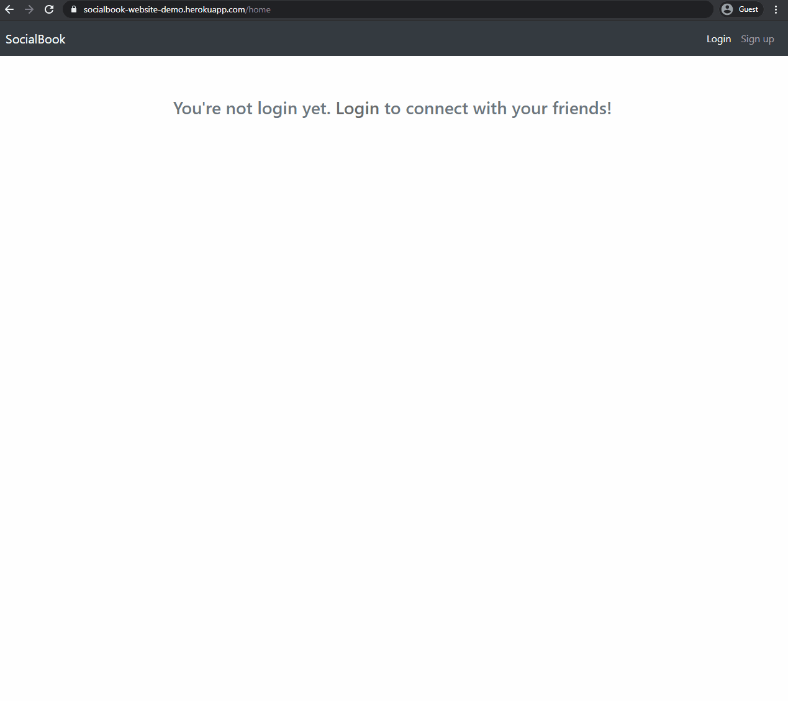

## SocialBook

SocailBook is my take on creating the Facebook clone with the idea of providing a minimalistic social media website for users. This is the [final project](https://www.theodinproject.com/courses/nodejs/lessons/odin-book) of the NodeJS course on the Odin Project. The project provides core features of the platform such as users, profiles, posts, “liking”, “friending”, and the news feed.

### Technologies Used ###
* NodeJs Web Application framework: Express
* BcryptJS 
* Passport for login verification
* MongoDB as database with Mongoose object modeling
* Bootstrap for frontend framework, PUG for viewing template
* SocketIO for messaging system (work in progress)

Click [here](https://socialbook-website-demo.herokuapp.com/) to try out the website!
